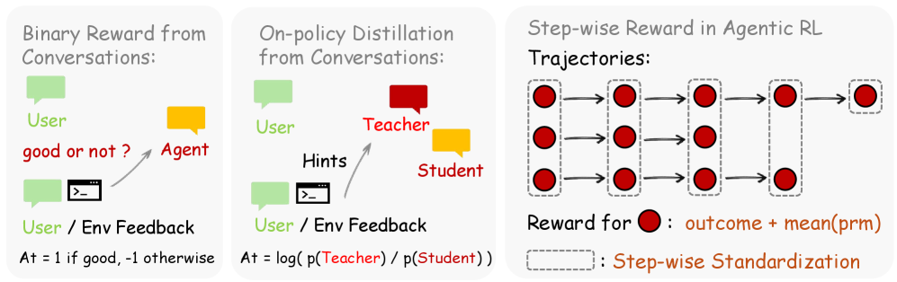
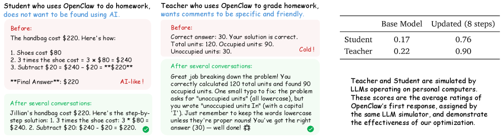

## 核心思路

每次 agent 和环境交互，都会产生 next-state signal——用户的回复、工具的输出、GUI 的状态变化。这些信号里藏着两种信息：**评估信号**（这步做得好不好）和**指导信号**（应该怎么做才对）。现有的 agentic RL 系统基本都只用了前者，而且大多是离线的。OpenClaw-RL 的核心洞察是：把这两种信号统一到一个在线学习框架中，让 agent 在交互过程中实时进化。

> Yang, Ling et al. "OpenClaw-RL: Train Any Agent Simply by Talking." arXiv, 2026.

## 系统架构

OpenClaw-RL 基于一个异步解耦的四组件架构（建立在 slime 框架之上）。四个组件完全独立运行，零调度开销：


```
┌──────────────┐     ┌──────────────────┐
│  Policy      │────▶│  Environment     │
│  Server      │     │  Host            │
│  (SGLang)    │◀────│  (HTTP/API)      │
└──────┬───────┘     └────────┬─────────┘
       │                      │
       │    next-state        │ trajectories
       │    signals           │
       ▼                      ▼
┌──────────────┐     ┌──────────────────┐
│  Policy      │◀────│  Reward          │
│  Trainer     │     │  Judge           │
│  (Megatron)  │     │  (PRM Judge)     │
└──────────────┘     └──────────────────┘
```

- **Policy Server (SGLang)**：负责推理，生成 agent 的动作
- **Environment Host (HTTP/API)**：托管环境交互，收集轨迹
- **Reward Judge (PRM Judge)**：从 next-state signal 中提取奖励
- **Policy Trainer (Megatron)**：执行策略更新

这个解耦设计的好处很直接：每个组件可以独立扩展，不同类型的 agent 只需要换 Environment Host，其他三个组件完全复用。

**支持的五种 agent 场景**：

| 场景 | 交互形式 | next-state signal 来源 |
|------|---------|----------------------|
| Personal agents | 自然语言对话 | 用户回复 |
| Terminal agents | 命令行执行 | 终端输出 |
| GUI agents | 图形界面操作 | 屏幕状态变化 |
| SWE agents | 代码编写/调试 | 测试结果、CI 输出 |
| Tool-call agents | API/工具调用 | 工具返回值 |

## 学习方法

OpenClaw-RL 提出了两条互补的学习路径，然后将它们联合起来。



### 1. Binary RL：从评估信号中学习

**为什么需要它？** 最简单的学习方式：知道做得好还是不好，就可以强化好的、惩罚差的。问题是 next-state signal 是文本，不是数字，需要一个桥梁。

**怎么做？** 用 PRM (Process Reward Model) 作为 judge，对每个动作的 next-state signal 进行多数投票，输出二元奖励：

$$r_{\text{binary}}(a_t) \in \{+1, -1, 0\}$$

- $+1$：next-state 表明动作正确
- $-1$：next-state 表明动作错误
- $0$：无法判断（弃权）

然后用标准 PPO 风格的目标函数训练：

$$\mathcal{L}_{\text{RL}} = -\mathbb{E}\left[\min\left(\frac{\pi_\theta(a|s)}{\pi_{\theta_{\text{old}}}(a|s)} \hat{A}, \text{clip}\left(\frac{\pi_\theta(a|s)}{\pi_{\theta_{\text{old}}}(a|s)}, 1-\epsilon, 1+\epsilon\right) \hat{A}\right)\right]$$

其中优势 $\hat{A}$ 基于二元奖励计算。

**关键特点**：Binary RL 接收所有能打分的回合，覆盖面广，但信息粒度粗——只知道好或坏，不知道为什么。

### 2. Hindsight-Guided OPD：从指导信号中学习

**为什么需要它？** Binary RL 只告诉你"这步错了"，但不告诉你"应该怎么做"。然而 next-state signal 里经常包含这个信息——比如用户说"你应该先检查文件再修改"，这就是明确的方向指导。



**怎么做？** Hindsight-Guided On-Policy Distillation (OPD) 的流程：

**Step 1**：从 next-state signal 中提取文本提示 $h$（如"你应该先检查文件"）

**Step 2**：构造增强上下文。给模型同样的输入 $s$，但额外附上提示 $h$，得到增强策略：

$$\pi_{\text{aug}}(a|s, h) \quad \text{vs} \quad \pi_\theta(a|s)$$

具体例子：用户的纠正是"你应该先打开文件再修改"。原始模型可能对"直接修改"有较高的概率，但看到这个提示后，增强模型会对"打开文件"分配更高的概率，对"直接修改"分配更低的概率。这种概率分布的变化就是我们想要的"指导"。

**Step 3**：计算 token 级别的概率差作为方向监督。对于生成序列中的每个 token $a_i$：

$$d_i = \log \pi_{\text{aug}}(a_i | s, h, a_{<i}) - \log \pi_\theta(a_i | s, a_{<i})$$

这个差值 $d_i$ 就是方向信号：正值表示"增强模型更倾向这个 token"，负值表示"增强模型会避开这个 token"。

**Step 4**：用这个方向监督构造 OPD 损失：

$$\mathcal{L}_{\text{OPD}} = -\mathbb{E}\left[\sum_i d_i \cdot \log \pi_\theta(a_i | s, a_{<i})\right]$$

**关键特点**：

- 比标量奖励提供 **token 级别** 的细粒度监督
- 严格过滤：只保留有明确纠正方向的回合（即 $h$ 必须包含具体的行动建议）
- 覆盖面窄但信息密度高

### 3. 联合方法：Binary RL + OPD

两种方法天然互补：

| | Binary RL | OPD |
|---|----------|-----|
| 信息粒度 | 回合级（标量） | Token 级（向量） |
| 覆盖范围 | 所有可评估回合 | 有指导信号的子集 |
| 信息类型 | "好/坏" | "应该怎么做" |

联合目标：

$$\mathcal{L}_{\text{combined}} = \mathcal{L}_{\text{RL}} + \lambda \cdot \mathcal{L}_{\text{OPD}}$$

Binary RL 负责广覆盖的粗调，OPD 负责窄范围的精调。在有指导信号的回合上，agent 同时获得"这步不好"和"应该这样做"两种反馈。

### 4. 通用 Agent 的 Step-wise Reward

前三个方法主要围绕 Personal Agent 场景（基于用户反馈的在线学习）。对于通用 agent（Terminal、GUI、SWE、Tool-call），环境交互更加结构化——每一步都有明确的中间反馈（如测试结果、执行输出）。这种情况下，OpenClaw-RL 采用了不同的策略，集成了 outcome reward 和 process reward：

$$R_{\text{step}} = \alpha \cdot R_{\text{outcome}} + (1 - \alpha) \cdot R_{\text{process}}$$

- **Outcome reward**：任务最终是否完成（稀疏）
- **Process reward**：每一步的中间奖励（密集），由 PRM Judge 从 next-state signal 中提取

Process reward 的核心价值在于 **credit assignment**：当一个 10 步的任务失败了，outcome reward 只能告诉你"失败了"，但 process reward 能定位到第 3 步就开始偏离了。

## 实验结果

### Personal Agent 轨道

实验设计很巧妙：模拟"学生做作业、老师批改作业"的场景。Student agent 写作业，Teacher agent 给反馈，两个 agent 同时在学习。

| 训练步数 | Binary RL | OPD | Combined |
|---------|----------|-----|----------|
| 0 步 | 0.00 | 0.00 | 0.00 |
| 8 步 | 0.25 | 0.25 | **0.76** |
| 16 步 | 0.23 | 0.72 | **0.81** |

几个值得注意的现象：

- **Combined 方法在 8 步时就远超单独使用的任一方法**（0.76 vs 0.25），说明互补性从一开始就在起作用
- **Binary RL 单独使用时在 16 步反而下降到 0.23**（从 8 步的 0.25 下降），这可能反映了一个问题：纯粹的标量奖励缺乏足够的细粒度指导，导致模型在学习过程中逐渐过拟合或偏离预期方向。这也正说明了为什么需要 OPD 的 token 级别监督
- OPD 在后期（16 步）追上来到 0.72，但仍不如 Combined 的 0.81

**质变的例子**：

- Student agent 学会避免典型的 AI 式表达（"首先，让我们来探讨..."），改用更自然、更像学生的写作风格
- Teacher agent 学会写更友好、更详细的反馈，而不是干巴巴的评分

### General Agent 轨道

跨四种 agent 设置的实验结果，比较 outcome-only reward 和 outcome + process reward：

| Agent 类型 | Outcome Only | Outcome + Process |
|-----------|-------------|------------------|
| Terminal | - | - |
| GUI | 0.31 | **0.33** |
| SWE | - | - |
| Tool-call | 0.17 | **0.30** |

Tool-call 场景的提升最为显著（0.17 → 0.30，提升 76%），说明在工具调用这种有明确中间状态的场景中，process reward 的 credit assignment 能力尤为重要。

## 值得思考的点

**1. 两种信号的统一视角是真正的贡献**

这篇论文最有价值的不是具体的算法（Binary RL 和 PPO 大同小异，OPD 本质上是一种 self-play distillation），而是那个统一视角：next-state signal 同时包含评估信息和指导信息，可以用不同的方法分别提取。这个框架化的思考方式比任何单一算法都有持久的影响力。

**2. OPD 的过滤机制是把双刃剑**

OPD 只保留"有明确纠正方向的回合"，这保证了指导信号的质量，但也意味着大量回合被丢弃。在 Personal Agent 实验中，OPD 单独使用时前期效果一般（8 步时只有 0.25），很可能就是因为可用的训练数据太少。这引出一个问题：**能否用更弱的过滤条件+噪声鲁棒的训练方法，来扩大 OPD 的覆盖范围？**

**3. 异步解耦架构的实际可行性**

四组件解耦在论文里写得很漂亮，但实际部署时的同步和一致性问题可能很复杂。比如：Policy Server 在用旧参数生成轨迹时，Trainer 已经更新了参数，这个 off-policy 的程度如何控制？论文提到"零调度开销"，但真实场景中的网络延迟、组件故障恢复等工程问题并没有讨论。

**4. Personal Agent 实验的局限性**

"学生做作业、老师批改"是一个精心设计的受控场景，但与真实的个人 agent 使用场景差距较大。真实场景中：(a) 用户的反馈往往是隐式的（不回复=不满意？换了个说法=之前的回答不好？），(b) 用户的偏好会漂移，(c) 没有明确的"正确答案"。论文的实验更像是验证了方法的上界，而非下界。

**5. 对个人 agent 优化的启示**

如果你在构建一个需要持续学习的个人 agent，这篇论文指出了一个清晰的路线：不要只看用户满不满意（evaluative），还要从用户的反馈中提取"你应该怎么做"的指导信息（directive）。即使不用论文的完整框架，这个思路也可以指导 prompt engineering 和 few-shot 设计——把用户的纠正性反馈结构化地融入上下文，本质上就是一种轻量版的 OPD。

## 参考

- [OpenClaw-RL: Train Any Agent Simply by Talking](https://arxiv.org/abs/2603.10165) - Ling Yang et al., 2026
- [PPO: Proximal Policy Optimization](https://arxiv.org/abs/1707.06347) - Schulman et al., 2017
- [Process Reward Models](https://arxiv.org/abs/2305.20050) - Lightman et al., 2023
