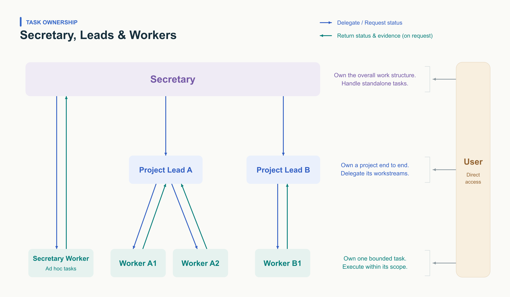
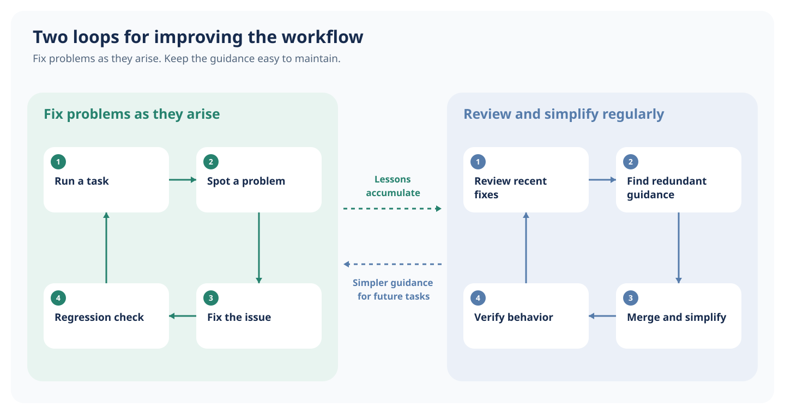
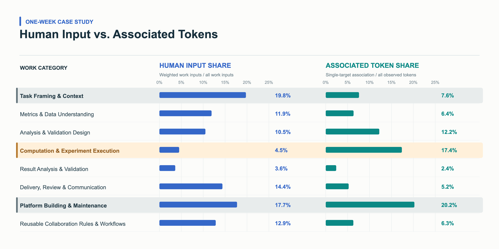

> Adapted from Yuming Feng’s “Working with AI: A Practical Research Workflow.” Meeting details, internal links, and experiment-specific information are omitted; reusable methods and selected original figures are retained. First-person examples describe the original presenter’s workflow.

> [中文版](./working-with-ai-research-workflow.md)

This article describes a practical research workflow: how to work with AI, divide responsibilities, keep track of context, and turn recurring problems into reusable fixes.

## 1. The case: from a hypothesis to evidence

- **Question:** start with an unexpected model result and identify a specific hypothesis that might explain it.
- **Investigation:** review individual cases and analyze training samples, then expand the time window to check whether the result is stable.
- **Working with AI:** I set the direction and judged the evidence; the agent collected cases, queried data, and summarized results. We clarified metric definitions and checked surprising findings together.
- **What this raised:** how do I split up the work, reuse context, and keep mistakes from recurring?

The reusable sequence is: frame a hypothesis → agree on definitions → collect cases and query data → expand the validation window → check denominators → interpret the evidence. A surprising proportion needs its numerator and denominator explained before it becomes a conclusion.

## 2. Roles and responsibilities

### Problem

**Putting everything in one conversation makes it harder for both the agent and me to stay focused.**

- **For the agent:** the context window is limited. Asking it to discuss the research, carry out tasks, and track progress all at once can make its work less reliable.
- **For me:** switching between chats, catching up on context, and checking progress takes time away from the research.

### Method

Give each agent a clear role, and keep the main project discussion in one place.

- **Secretary:** helps me keep track of priorities and progress across projects.
- **Lead:** owns one project: we discuss the approach together, then it delegates tasks and brings the findings together.
- **Worker:** handles a clearly scoped task and reports back with evidence and open questions.

Each agent keeps the context it needs for its role. I can clarify a specific point directly with a Worker, but the Lead still brings the project findings together. The sidebar helps me see who owns each task and where it stands.



### In this case

- **Frame the hypothesis:** I first explored the research question with the Secretary, which suggested setting up a Project Lead and started that task.
- **Plan the investigation:** The Lead and I worked out how to test the hypothesis.
- **Carry out the analysis:** The Lead assigned Workers to collect cases and analyze the label data with SQL.
- **Combine the evidence:** the Lead pulled together the findings from both rounds. I could clarify details with a Worker while keeping the main conversation focused on what to investigate next and what the results meant.

A consistent task name can make this visible in a sidebar: `[Project] Lead | Research question`, `[Project] W01 | Case review (RUNNING)`, and `[Project] W02 | Sample analysis (REVIEW LEAD)`.

## 3. Memory and knowledge organization

### Problem

**Important context becomes scattered across conversations and files.** I end up explaining the same terms, experiment history, and procedures again—and earlier decisions can get lost along the way.

For example, a sample may select interactions on day T0 and join outcome labels from day T1. A new agent needs the exact inclusion criteria, time boundaries, and join definition; a short metric name alone is not enough.

### Method

I use three categories from [LangChain’s discussion of agent memory](https://www.langchain.com/blog/memory-for-agents) to organize this context:

- **Semantic memory:** project goals, key terms, and what the data represents.
- **Episodic memory:** what we tried, what happened, and why we made each decision. Experiment records track each experiment from start to finish; studies capture investigations into specific questions.
- **Procedural memory:** how to do the work, captured in skills, scripts, and reference material.

```plaintext
<project>
├── AGENTS.md
├── CURRENT.md                   Current snapshot · Required on entry
├── context/                     Semantic Memory
│   ├── AGENTS.md
│   ├── INDEX.md
│   └── <topic>.md
├── experiments/                 Episodic Memory · Experiment lifecycle
│   ├── AGENTS.md
│   ├── model-training/
│   │   ├── INDEX.md
│   │   └── <version>/
│   └── ab-testing/
│       └── INDEX.md
├── studies/                     Episodic Memory · Focused investigation
│   ├── AGENTS.md
│   ├── INDEX.md
│   └── <study>/
└── workflow/                    Procedural Memory
    ├── AGENTS.md
    └── <procedure>/
        ├── SKILL.md
        ├── scripts/
        └── references/
```

**Writing:** each folder’s AGENTS.md explains what belongs there, how to record it, and how to keep the index up to date.

**Reading:** start with CURRENT.md to understand the project’s status, main blocker, and next decision. Use the indexes to look up definitions, evidence, or procedures as the task requires.

### In this case

- **Understand the labels:** the agent looks up the sample and label definitions in the context index.
- **Identify the comparison:** it finds the relevant models and experiments through the experiment indexes.
- **Collect cases:** it follows the workflow index to the case-analysis skill, scripts, and references.
- **Preserve findings:** it saves the findings under studies and updates the index so the next task can find them.

With this structure, the agent can find the background it needs. I focus on the question at hand, confirm key definitions, and decide what the evidence means.

## 4. Fix recurring problems and keep the workflow manageable

### Problem

**Fixing a mistake is only half the job; the instructions also need to stay manageable.** If every correction adds another note or check, the workflow gradually fills up with duplicate rules and outdated requirements.

### Method

I approach this as two connected cycles:

- **Fix problems as they arise:** when I flag a bug or a misinterpreted definition, a hook can start a repair workflow. Update the relevant code or skill, then check that the fix works and existing behavior still holds.
- **Review the accumulated fixes:** a scheduled review can combine duplicate instructions, remove obsolete checks, and verify that the simpler workflow still works.

Hooks can start the repair cycle when feedback arrives; scheduled automations can start the cleanup cycle. I still judge the problem and the proposed fix, but I do not have to arrange every follow-up step.



### In this case

- **Correct the definition:** after an agent misinterpreted a sample definition, we added the default definition to the relevant skill so future tasks could use it.
- **Consolidate the guidance:** review these additions together from time to time, merging repeated guidance and clearing up ambiguity.

A fix should help the next task, not just the current chat. Periodic cleanup keeps those fixes useful without burying them in more instructions.

## 5. Practical tips

- **Use your voice.**
  - **Dictation:** use a shortcut to start and stop recording, then review the text and send. It is still a turn-based conversation—useful when you need time to read or think between instructions.
  - [**Live voice chat:**](https://steventan0110.github.io/blog/2026/voice-agent-as-an-event-loop/) discuss a problem, get quick feedback, and delegate or redirect tasks while they run. Conversation and execution happen together, more like a working session. Use it for active back-and-forth; switch to dictation for long stretches of quiet thinking.

- **Teach dictation your vocabulary.** When your dictation tool supports a custom dictionary, save corrected names and technical terms there, then check that the correction persists.
- **Check in from your phone.** If your setup supports remote access, follow progress and send a quick follow-up when you are away from your desk. Work from anywhere (maybe that’s not a good thing).
- **Prefer CLI → API → DOM.** Start with the official CLI when available. Otherwise, ask the agent to find and use the underlying API. These interfaces are usually less sensitive to UI changes, and APIs make batch operations easier. Use browser DOM automation as a fallback.
- **Put routine work on a loop.** Use [Loop Engineering](https://addyosmani.com/blog/loop-engineering/) for repeatable tasks with clear checks. For production monitoring, I use scheduled checks: stay quiet when things are normal, flag issues when they need attention. This saves me from repeatedly checking in. Keep human judgment involved when research questions, definitions, or interpretations are still evolving.

## 6. Takeaways

- **Let AI handle the work.** Delegate clearly defined tasks. Stay involved in the decisions, check the evidence, and save what the next task will need.
- **Keep learning. Keep practicing.** AI moves quickly. Follow people who build in public, join the discussion, and try useful ideas in your own work. I use different sources for different things:
  - **X:** quick tips, new ideas, and candid progress updates from builders.
  - **Technical blogs:** my first choice for depth and a clear, structured explanation of how something works.
  - **Interviews and podcasts:** useful context and firsthand perspectives, though I find the reasoning less structured than in a good technical blog.
  - **Demos and walkthroughs:** concrete examples to try and adapt.
  - **A daily starting point:** [Tidemark](https://harry20030331.github.io/tidemark/), an AI reading digest built on [Zara Zhang’s Follow Builders](https://github.com/zarazhangrui/follow-builders). Follow the original sources when something catches your attention.

- **Build your own agent.** Start with one task you care about, shape the workflow around how you work, and improve it through use.

**Enjoy building!**



This is an illustrative one-week breakdown from the source, not a controlled productivity benchmark. Human input share uses weighted work inputs as its denominator; associated token share uses all observed tokens. These percentages cannot be divided to infer a speedup, and token usage is not a measure of delivered research value.
