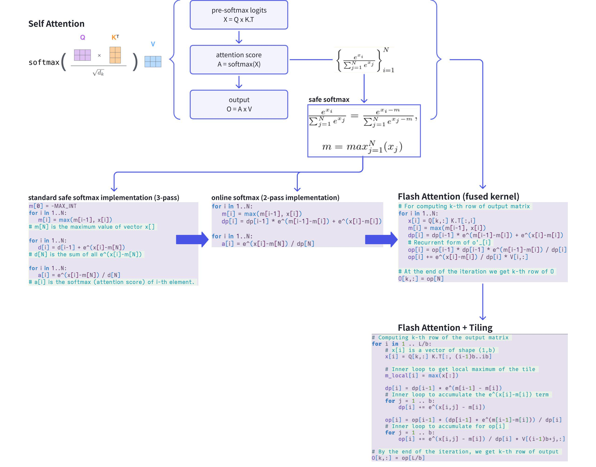
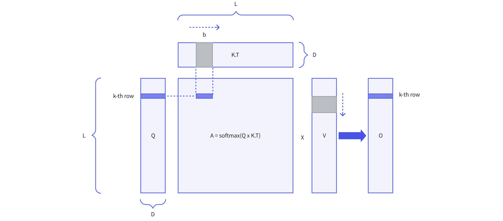
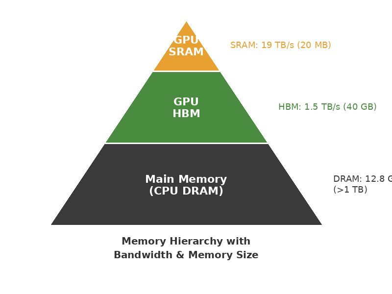

> 🌐 [中文版](./flash-attention-varlen.md)

## Core Concept

Flash Attention is an IO-aware implementation of Self-Attention. By using **kernel fusion + tiling**, it compresses the entire $QK^TV$ computation into a single GPU kernel, avoiding repeated HBM reads/writes and achieving significant speedup without any precision loss.

Algorithm evolution overview:



---

## Why Standard Attention Is Slow

The standard implementation has three steps, each running as a separate CUDA kernel. Intermediate results must be written back to HBM and read again by the next kernel:

$$X = QK^T \quad\rightarrow\quad A = \text{softmax}(X) \quad\rightarrow\quad O = AV$$

Specifically:

1. **Compute $X = QK^T$**: Read $Q$ (shape $L \times D$) and $K$ (shape $L \times D$) from HBM, compute $X$ (shape $L \times L$), **write back to HBM**
2. **Compute $A = \text{softmax}(X)$**: **Re-read** $X$ from HBM, apply softmax to get $A$ (shape $L \times L$), **write back to HBM**
3. **Compute $O = AV$**: **Re-read** $A$ and $V$ from HBM, perform matrix multiplication to get the final output $O$

The problem is that intermediate matrices $X$ and $A$ both have shape $(L, L)$:



When $L$ is large (e.g., 128K), the $(L, L)$ matrix can't fit in SRAM at all. The HBM reads/writes between three kernels become the bottleneck — the computation itself isn't slow, **moving data is slow**.

---

## GPU Memory Hierarchy



Understanding Flash Attention requires understanding the GPU memory hierarchy:

- **SRAM** (on-chip cache): ~19 TB/s bandwidth, but only ~20 MB capacity. Each SM's shared memory belongs to this tier.
- **HBM** (GPU memory): ~1.5 TB/s bandwidth, ~40 GB capacity (A100). All tensors live here by default.
- **DRAM** (main memory): ~12.8 GB/s bandwidth, >1 TB capacity. CPU-side memory, not directly accessed by GPU.

SRAM bandwidth is **10x+ higher** than HBM, but capacity is 2000x smaller. Flash Attention's core idea: since SRAM is fast but small, split large matrices into small blocks, compute each block in SRAM, then write back — minimizing HBM round-trips.

---

## Key Derivation: Compressing Three Steps into One

Standard Attention requires three kernels because softmax needs to see the entire row to compute — you need the max and sum before normalizing. The following derivation eliminates this dependency step by step.

### Safe Softmax

Using $e^x$ directly overflows easily (in FP16, $x > 11$ already overflows), so we subtract the row maximum first:

$$\text{softmax}(x_i) = \frac{e^{x_i - m}}{\sum_j e^{x_j - m}}, \quad m = \max_j x_j$$

The naive implementation requires **3 passes** over the row:

```
pass 1: m = max(x_1, x_2, ..., x_N)         // find max
pass 2: d = sum(exp(x_j - m) for j in 1..N)  // compute normalizer
pass 3: a_i = exp(x_i - m) / d               // compute each element
```

Three passes means reading this row from HBM three times. Can we do fewer?

### Online Softmax (3-pass → 2-pass)

Key observation: can we merge pass 1 and pass 2? The problem is that pass 2 needs the global max $m_N$, but $m$ keeps changing during pass 1.

The trick: define a **proxy variable** $d'_i$ that doesn't depend on the global $m_N$:

$$d'_i = \sum_{j=1}^{i} e^{x_j - m_i}$$

Note this uses the **local max** $m_i = \max(x_1, ..., x_i)$, not the global $m_N$. When $i = N$, $d'_N = d$ — exactly the normalizer we need.

$d'_i$ satisfies a recurrence (straightforward to derive):

$$d'_i = d'_{i-1} \cdot e^{m_{i-1} - m_i} + e^{x_i - m_i}$$

Intuition: when a new element $x_i$ causes the max to update from $m_{i-1}$ to $m_i$, the accumulated sum $d'_{i-1}$ must be multiplied by $e^{m_{i-1} - m_i}$ as a correction (if $m_i > m_{i-1}$, this factor is < 1, scaling down the previously overestimated part).

Now $m_i$ and $d'_i$ can be updated in the same loop:

```
for i in 1..N:
    m[i]  = max(m[i-1], x[i])
    dp[i] = dp[i-1] * exp(m[i-1] - m[i]) + exp(x[i] - m[i])
```

This reduces 3-pass to **2-pass** (the loop above is pass 1; pass 2 uses $m_N$ and $d'_N$ to compute each element).

### Flash Attention (2-pass → 1-pass)

We don't just need softmax values — we need the final output $O = AV$. Can we fold pass 2 in as well?

For the $k$-th row, define a **proxy output**:

$$o'_i = \sum_{j=1}^{i} \frac{e^{x_j - m_i}}{d'_i} V[j, :]$$

Using the same correction idea, $o'_i$ satisfies:

$$o'_i = o'_{i-1} \cdot \frac{d'_{i-1} \cdot e^{m_{i-1} - m_i}}{d'_i} + \frac{e^{x_i - m_i}}{d'_i} V[i, :]$$

The intuition is similar to the $d'$ correction: when the max updates, the accumulated weighted sum $o'_{i-1}$ must be corrected accordingly. The final $o'_N$ is the exact output.

Now $m_i$, $d'_i$, and $o'_i$ are all updated in **a single loop**, making the entire Self-Attention **1-pass**:

```python
for i in 1..N:
    x[i]  = Q[k,:] @ K.T[:,i]
    m[i]  = max(m[i-1], x[i])
    dp[i] = dp[i-1] * exp(m[i-1]-m[i]) + exp(x[i]-m[i])
    op[i] = op[i-1] * dp[i-1] * exp(m[i-1]-m[i]) / dp[i]
    op[i] += exp(x[i]-m[i]) / dp[i] * V[i,:]
O[k,:] = op[N]
```

**Memory usage**: The loop only needs scalars $x_i$, $m_i$, $d'_i$ and a vector $o'_i$ of length $D$ — total memory $O(D)$, independent of sequence length $N$. This is why the entire computation can stay in SRAM.

### Tiling

In the recurrence above, the updates to $d'$ and $o'$ are purely additive and multiplicative — they're associative. This means we don't need to process element by element; we can work **in blocks**: split $K$ and $V$ along the sequence dimension into blocks of size $B_c$, load each block into SRAM, compute, and accumulate into $o'$.


Specifically:

1. Outer loop iterates over Q blocks (size $B_r$)
2. Inner loop iterates over K, V blocks (size $B_c$)
3. Compute this block's $QK^T$, softmax (with correction), multiply by V in SRAM
4. Accumulate into the current Q block's output $o'$

Block size depends on SRAM capacity: it must simultaneously hold the Q block ($B_r \times D$), K block ($B_c \times D$), V block ($B_c \times D$), and intermediate results ($B_r \times B_c$).

| | HBM Access | Memory Usage |
|--|--|--|
| Standard Attention | $O(N^2)$ | $O(N^2)$ |
| Flash Attention | $O(N^2 / M)$ | $O(N)$ |

$M$ is the SRAM size. HBM access is reduced by a factor of $M$ (~100× on A100). End-to-end speedup is roughly **2–4×** (since computation itself also has overhead).

---

## Real-World Scenario: Attention Optimization in Recommender Systems

Recommender systems heavily use Transformer Encoders for user behavior sequence modeling (e.g., encoding livestream summaries). A typical characteristic of these scenarios: sequences in a batch vary greatly in length and must be padded to the same length.

```
seq1: [t1...t150]               ← 150 real tokens
seq2: [t1...t80,  PAD×70]       ← 70 PADs wasted
seq3: [t1...t30,  PAD×120]      ← 120 PADs wasted
```

There are two independent optimization directions that can be applied separately or combined:

| Direction | Problem Solved | Approach |
|--|--|--|
| **Remove padding** | PAD tokens waste computation | unpad → varlen → repad |
| **Flash Attention** | Too many HBM round-trips in Attention | kernel fusion + tiling |

---

### Optimization 1: Remove Padding (unpad + varlen attention)

This optimization is unrelated to Flash Attention. The core idea: token $t_i$'s output only depends on other tokens in the same sequence, regardless of batch index:

$$\text{out}(t_i) = \sum_{j \in \text{same seq}} \text{softmax\_score}(t_i, t_j) \cdot V(t_j)$$

Therefore, we can physically concatenate all real tokens into a single sequence and use `cu_seqlens` to record sequence boundaries, completely replacing the batch dimension:

```
[seq1 tokens | seq2 tokens | seq3 tokens]  total = 260
cu_seqlens = [0, 150, 230, 260]
```

The attention kernel ensures seq1 only attends to `[0, 150)`, seq2 only to `[150, 230)`. The result is equivalent to masking, but eliminates all wasted computation on PAD tokens.

#### FFN Doesn't Need Changes

After unpadding, you can directly apply LayerNorm and FFN without re-padding first:

```
(B, 150, 128)
      ↓  unpad_input (once)
(total_tokens, 128)
      ↓  Attention (varlen)
      ↓  LayerNorm          ← token-wise, no boundary info needed
      ↓  FFN                ← nn.Linear only sees last dim, shape-agnostic
      ↓  LayerNorm
      ↓  pad_input (once)
(B, 150, 128)
```

FFN weights have shape `(128, 512)` and `(512, 128)` — no sequence length dimension. Computing on `(total_tokens, 128)` vs `(B, 150, 128)` gives identical per-token results.

---

### Optimization 2: Flash Attention

This is the kernel fusion + tiling approach derived above, reducing Attention's HBM access from $O(N^2)$ to $O(N^2/M)$. This optimization works for both fixed-length and variable-length sequences — it's orthogonal to whether you remove padding or not.

---

### Combined: Flash Attention + varlen

`flash_attn_varlen_func` combines both optimizations — using `cu_seqlens` to skip padding while using tiling to reduce HBM access:

```python
from flash_attn.bert_padding import unpad_input, pad_input
from flash_attn import flash_attn_varlen_func

# x: (B, 150, 128), attention_mask: (B, 150)
x_unpad, indices, cu_seqlens, max_seqlen = unpad_input(x, attention_mask)
# x_unpad: (total_real_tokens, 128)

q = q_proj(x_unpad).reshape(-1, 4, 32)
k = k_proj(x_unpad).reshape(-1, 4, 32)
v = v_proj(x_unpad).reshape(-1, 4, 32)

out = flash_attn_varlen_func(
    q, k, v,
    cu_seqlens_q=cu_seqlens, cu_seqlens_k=cu_seqlens,
    max_seqlen_q=max_seqlen, max_seqlen_k=max_seqlen,
    causal=False,
)

out = pad_input(out.reshape(-1, 128), indices, B, 150)
# → (B, 150, 128)
```

---

## References

- [FlashAttention Paper](https://arxiv.org/abs/2205.14135) — Dao et al., NeurIPS 2022
- [FlashAttention-2](https://arxiv.org/abs/2307.08691) — Dao, ICLR 2024
- [UW CSE 599M Lecture Notes](https://courses.cs.washington.edu/courses/cse599m/23sp/notes/flashattn.pdf)
