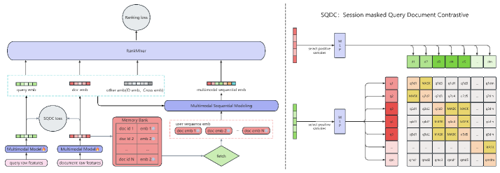
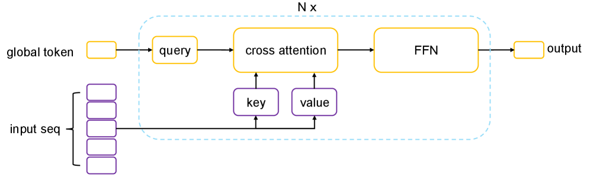
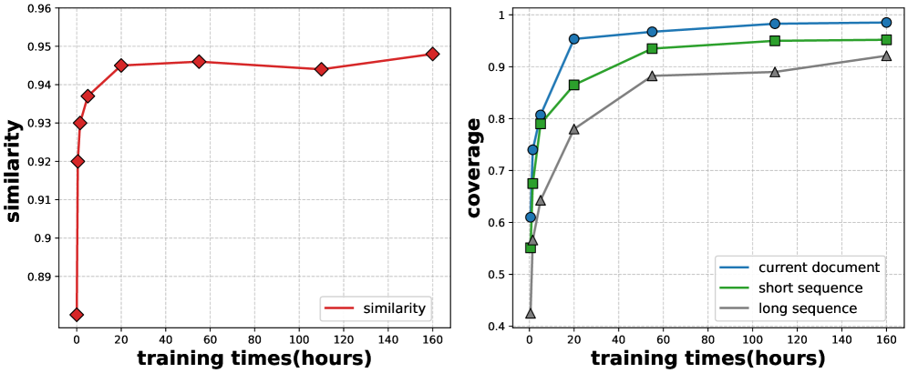

> 🌐 [Read in English](./lemur-e2e-multimodal-rec.en.md)

论文精读笔记：[LEMUR: Large scale End-to-end MUltimodal Recommendation](https://arxiv.org/abs/2511.10962)（ByteDance，2025）

## 核心思路

工业界多模态推荐系统普遍是两阶段：先预训练多模态模型，再冻结 Embedding 给排序模型用。这套框架有三个根本缺陷：多模态表示和排序目标没对齐、多模态模型不能随数据实时更新、用户历史序列的多模态 Embedding 传输成本极高。LEMUR 把多模态编码器和排序模型端到端联合训练，用 Memory Bank 解决序列计算瓶颈，是第一个在工业规模上落地的端到端多模态推荐系统。

## 问题背景

传统 ID-based 推荐模型天然有两个缺陷：冷启动（新用户/新视频没历史数据）和泛化性差（行为稀疏时模型高方差）。多模态信息（文本、图像）可以缓解这两个问题，因为内容特征不依赖历史交互。

但现有工业方案几乎都是两阶段的：

1. 离线预训练 CLIP/BLIP 等多模态模型
2. 冻结 Embedding，作为独立服务供排序模型调用

这带来四个问题：
- **表示不对齐**：多模态 Embedding 是在通用内容任务上学的，和排序目标（点击率）之间有 gap
- **ID Embedding 过重**：排序模型倾向于把信息全塞进 ID Embedding，多模态 Embedding 反而欠拟合
- **更新频率不匹配**：排序模型实时更新，多模态模型长时间冻结，逐渐脱节
- **传输瓶颈**：用户历史序列动辄 1000+ 条，每条都有高维 Embedding，在线传输成本极高

## 系统架构

LEMUR 由四个核心模块组成：**多模态 Transformer 编码器**、**SQDC 对比损失**、**Memory Bank**、**多模态序列建模**。

### 1. 多模态 Transformer 编码器

用两个双向 Transformer 分别编码 query 和 document 的文本特征：

$$q_i = \text{Transformer}(q_\text{raw}^i)$$
$$d_i = \text{Transformer}(d_\text{raw}^i)$$

Document 文本输入包含四类信息：OCR 识别文字、ASR 语音转文字、视频标题、封面 OCR 文字。Query 和 document 各有一个 `[CLS]` token，输出作为整体表示。

关键：这个 Transformer **不是冻结的**，和 RankMixer 排序模型**联合梯度更新**。

### 2. SQDC：Session-masked Query-Document Contrastive

受 CLIP 启发，用对比学习对齐 query 和 document 的表示空间。标准 in-batch 对比损失是：

$$\ell_\text{contrastive} = \sum_{i, \text{label}_i=1} -\log \frac{\exp(\text{sim}(q_i, d_i) \cdot T)}{\sum_{j=0}^{K} \exp(\text{sim}(q_i, d_j) \cdot T)}$$

其中 $\text{sim}(q, d) = \frac{q^T d}{\|q\|\|d\|}$ 是 cosine 相似度，$T$ 是温度超参。

但搜索场景有个特殊问题：同一个 batch 里可能有多个来自**同一 query（同一 session）** 的样本。这些样本之间高度相关，如果直接作为负例会干扰训练。SQDC 引入 session-level mask 解决这个问题：

$$\ell_\text{SQDC} = \sum_{i, \text{label}_i=1} -\log \frac{\exp(\text{sim}(q_i, d_i) \cdot T)}{\sum_{j=0}^{K} A_{ij} \cdot \exp(\text{sim}(q_i, d_j) \cdot T)}$$

$$A_{ij} = \begin{cases} 0 & \text{if } i \neq j \text{ and } \text{QID}_i = \text{QID}_j \\ 1 & \text{else} \end{cases}$$

同 query 的样本彼此 mask 掉，不作为负例。

### 3. Memory Bank

这是解决**序列计算瓶颈**的核心设计。

**问题规模**：batch size 2048 时，排序模型（RankMixer）消耗 1.6 TFLOPs，document Transformer 消耗 2.3 TFLOPs。如果对每个用户的历史序列（1000+ 条）都跑一遍 Transformer，计算量增加 1000 倍，完全不可行。

**解法**：在每个训练 batch 中，把当前 document 的 Embedding 存入 Memory Bank（以 doc ID 为 key）。构建用户历史序列时，直接从 Memory Bank 查表取 Embedding，不再重新跑 Transformer。

训练数据跨度 70 天，用户历史窗口 1 个月，Memory Bank 覆盖率足够。

### 4. 多模态序列建模

历史序列 $\{d_1, d_2, \ldots, d_N\}$ 通过 Decoder 模块（改自 LONGER）压缩：

$$Q_{i+1} = \text{FFN}\bigl(\text{CrossAttention}(Q_i, d_1, d_2, \ldots, d_N)\bigr)$$

$$\text{CrossAttention}(Q_i, d_1, \ldots, d_N) = \sum_{j=1}^{N} a(Q_i, d_j) d_j$$

$$a(Q_i, d_j) = \frac{\exp(Q_i^T d_j)}{\sum_{j=1}^{N} \exp(Q_i^T d_j)}$$

此外还有一个 similarity module，计算目标 document 和历史序列每条的 cosine 相似度（以及排名版本），和 Decoder 输出一起拼接进 RankMixer。最长序列有 1000 条历史。

## 训练目标

主任务：二元交叉熵（CTR 预测，正样本为观看超过 5 秒）：

$$\ell_\text{CTR} = -\frac{1}{|\mathcal{D}|} \sum_{(x,y) \in \mathcal{D}} \left[y \log \hat{y} + (1-y) \log(1-\hat{y})\right]$$

辅助任务：SQDC 对比损失，联合优化：

$$\ell = \ell_\text{CTR} + \lambda \cdot \ell_\text{SQDC}$$

## 效率优化

端到端训练的主要额外开销来自 document Transformer。三个优化手段：

1. **Flash Attention + 混合精度**：标准工程加速
2. **20% 采样**：只有 20% 的样本真正跑 Transformer forward/backward，其余直接从 Memory Bank 取 cached embedding
3. **跨 worker 去重**：同一 batch 内相同 document 共享 Transformer 计算，每个唯一 document 只算一次

推理时 Transformer 完全不参与，全部从 Memory Bank 查表。

## 实验结果

### 离线对比（抖音搜索，30 亿样本，70 天数据）

| 模型 | QAUC | ΔQAUCvs DLRM-MLP |
|---|---|---|
| DLRM-MLP（基线） | — | — |
| RankMixer | — | +0.59% |
| LONGER | — | +0.45% |
| RankMixer + LONGER（在线基线） | — | — |
| LEMUR-SQDC | — | +0.47% vs 在线基线 |
| **LEMUR-SQDC-MB** | — | **+0.81% vs 在线基线** |

工业场景里 0.1% QAUC 提升就足够影响线上 A/B 结果，0.81% 是很显著的提升。

### vs 两阶段方法

同样用 SQDC loss 预训练 Transformer（一个月数据），冻结后用于下游推荐。
**LEMUR 端到端训练比两阶段高出 0.69% QAUC**，验证了联合优化的必要性。

### 线上 A/B 测试（抖音搜索）

- 14 天 A/B 测试，query 改写率（用户修改搜索词的概率）**下降 0.843%**
- 统计显著（T-test 通过）
- 已全量部署，运行超过 1 个月

### Memory Bank 收敛分析

Memory Bank 有两个潜在问题：
- **Staleness（陈旧性）**：缓存的 Embedding 和当前模型输出的差距。实验显示相似度从 0.92 快速上升到 0.945 后趋于稳定，陈旧性影响不大
- **Coverage（覆盖率）**：序列中有多少 item 能在 Memory Bank 里找到。当前 document 覆盖率 > 98%，短序列 ~0.95，长序列 ~0.93，均超过 90%

### Ablation

| 配置 | ΔQAUC |
|---|---|
| LEMUR-SQDC-MB（完整） | +0.81% |
| 去掉 Memory Bank | +0.47%（即 LEMUR-SQDC） |
| 去掉 SQDC，只用 CTR loss | 更低 |

Memory Bank 贡献了 0.34% 的额外提升。SQDC temperature 最优值为 50。

## 值得思考的点

1. **Memory Bank 的本质是异步更新的参数服务器**：和 SARM 的 Memory Bank 思路一脉相承——在线不跑重模型，查缓存。区别是 LEMUR 的 Memory Bank 在训练中实时写入（当前 batch 写，历史 batch 读），而 SARM 是定期离线更新。LEMUR 这种设计的 staleness 问题已经通过实验验证影响很小（0.95 相似度），但本质上还是用"近似"换了"实时"。

2. **SQDC vs CIC（Content-ID Contrastive）**：论文提到，当 Transformer 和排序模型联合更新时，EM3 提出的 CIC loss 反而没有额外收益。这很有意思——对齐多模态和 ID 表示的 loss 在冻结 Transformer 时有用，但端到端时反而多余了。说明端到端训练本身就能隐式完成对齐。

3. **只用 20% 样本跑 Transformer，真的够吗？**：论文给出了实验数据（Table 4），但没有详细分析哪 20% 最重要。随机采样？还是有优先级？这个采样策略的细节值得深究。

4. **Document Transformer 只有 4 层**：为了延迟和计算量妥协，4 层 BERT-style encoder 能学到多深的语义？特别是对于短视频这种高度依赖视觉内容的场景，纯文本特征（OCR+ASR+标题）的天花板在哪？

5. **这篇和 SARM 的本质区别**：SARM 用 LLM 离线生成自然语言描述作为"语义锚点"，再轻量编码；LEMUR 直接端到端训练文本 Transformer。SARM 适合内容非平稳（直播）场景，LEMUR 适合大规模搜索场景。两者都解决了"多模态和排序解耦"的问题，路径不同。

## 参考

- [LEMUR: Large scale End-to-end MUltimodal Recommendation](https://arxiv.org/abs/2511.10962)（arXiv 2511.10962）
- [RankMixer](https://arxiv.org/abs/2501.14742)（Zhu et al., 2025）
- [LONGER](https://arxiv.org/abs/2503.01375)（Chai et al., 2025）
