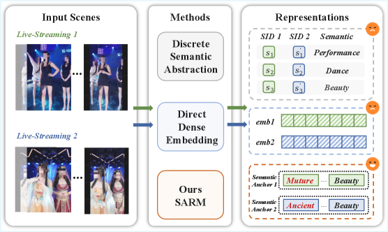
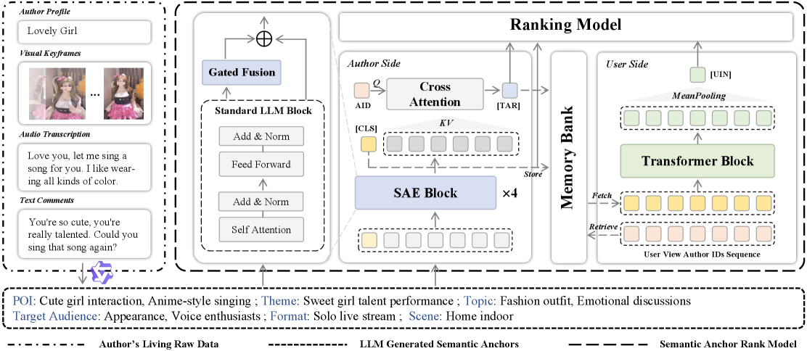

> 🌐 [中文版](./sarm-llm-livestream-ranking.md)

Paper reading notes: [SARM: LLM-Augmented Semantic Anchor for End-to-End Live-Streaming Ranking](https://arxiv.org/abs/2602.09401) (Kuaishou, 2026)

## Core Idea

Live-streaming recommendation is harder than short-video recommendation because content is real-time, unstructured, and multimodal. Existing approaches either use discrete abstractions (tags, Semantic IDs) that sacrifice semantic precision, or dense MLLM embeddings that are weakly aligned with ranking objectives. SARM's key insight: **treat LLM-generated natural language descriptions ("semantic anchors") as first-class ranking units that are directly optimized end-to-end**, rather than frozen feature inputs.

## Method Comparison

The paper categorizes existing approaches into three types, each with clear limitations:

- **Discrete semantics** (Tags / Semantic IDs): constrained by fixed vocabularies, losing fine-grained information. "Singing" and "anime-style singing" may collapse to the same tag
- **Dense embeddings** (MLLM Embedding): semantically rich but weakly aligned with ranking—embeddings are optimized for understanding tasks, not CTR
- **SARM**: preserves full semantics via natural language while optimizing token embeddings end-to-end under ranking loss

## System Architecture

### Semantic Anchor Generation

A fine-tuned MLLM generates natural language descriptions for each live stream across six dimensions offline: Point of Interest, Theme, Topic, Target Audience, Format, and Scene.

For example: "Cute girl interaction, anime-style singing; Sweet talent performance; Fashion outfit, emotional discussions; Appearance fans, voice enthusiasts; Solo livestream; Home indoor"

### Semantic Anchor Encoder (SAE)

SAE is the core technical contribution, addressing three problems:

**1. Live-Streaming Tokenizer**

Standard LLM tokenizers fragment domain-specific terms—"PUBG" becomes P/UB/G, "anime-style singing" splits into multiple subwords. The paper runs BPE on the semantic anchor corpus to merge frequently co-occurring domain tokens into atomic units:

$$A_s = \{t_1, t_2, \ldots, t_n\}$$

Merge rule: $(t_a, t_b) \to u, \quad u \in V_{\text{new}}$

**2. Gated Fusion**

The key question: how to inject domain-specific token knowledge into a pretrained LLM without destroying its language understanding capabilities?

New tokenizer domain tokens go through an independent embedding lookup table producing $e'_i$, then fuse with the LLM's hidden state $h_i$ via a gating mechanism:

$$k_i = W_K e'_i, \quad v_i = W_V e'_i$$

$$\alpha_i = \sigma\left(\frac{\text{RMSNorm}(h_i)^T \cdot \text{RMSNorm}(k_i)}{\sqrt{d}}\right)$$

$$h'_i = h_i + \alpha_i \cdot v_i$$

Intuition: $\alpha_i$ is a [0,1] gate that injects domain knowledge only when relevant to the current hidden state, otherwise preserving the LLM's original representation.

**3. Lightweight Encoder**

A 4-layer BERT-style encoder with rotary positional encoding, outputting the CLS token as the aggregated semantic anchor representation:

$$h = \text{SAE}(A_s, A'_s), \quad h_{\text{CLS}} = h[0]$$

### Identity-Aware Representation

Semantic anchors alone cannot distinguish different streamers within the same category. The paper introduces learnable author ID embeddings $h^a_{\text{id}}$, fused with semantic representations via cross-attention:

$$h^a_{\text{TAR}} = \text{CrossAttention}(h^a_{\text{id}},\; h,\; h)$$

Each streamer gets both category-level semantics ("singing streamer") and individual-level features ("this specific singing streamer").

### User Interest Modeling

Takes the most recent $m$ streamers' CLS representations from the user's viewing history, encoded through a Transformer and mean pooling:

$$h^u = (h^{a_0}_{\text{CLS}}, h^{a_1}_{\text{CLS}}, \ldots, h^{a_m}_{\text{CLS}})$$

$$h^u_{\text{UIN}} = \text{MeanPooling}(\text{Transformer}(h^u))$$

### Ranking Model

All three semantic representations are concatenated with conventional ranking features and fed into the multi-task ranking backbone:

$$\hat{y}^{\text{xtr}} = \text{MultiTask}(\text{Concat}[h^a_{\text{CLS}},\; h^a_{\text{TAR}},\; h^u_{\text{UIN}},\; h_{\text{rank}}])$$

## Training Objectives

### Main Ranking Loss

Multi-task binary cross-entropy across four engagement signals—CTR, WTR (watch time rate), LVTR (long view time rate), GTR (gift rate):

$$\mathcal{L}_{\text{rec}} = -\sum_{\text{xtr}}^{\text{Tasks}} \left( y^{\text{xtr}} \log \hat{y}^{\text{xtr}} + (1 - y^{\text{xtr}}) \log(1 - \hat{y}^{\text{xtr}}) \right)$$

### Auxiliary CTR Loss

Joint training of semantic encoding and ranking creates alignment challenges between textual understanding and discriminative ranking spaces. An auxiliary CTR prediction head on author-side representations stabilizes convergence:

$$\hat{y}_{\text{aux}} = \text{MLP}(\text{Concat}[h^a_{\text{CLS}},\; h^a_{\text{TAR}}])$$

$$\mathcal{L}_{\text{aux}} = -y \log \hat{y}_{\text{aux}} - (1-y) \log(1-\hat{y}_{\text{aux}})$$

### Total Loss

$$\mathcal{L} = \mathcal{L}_{\text{rec}} + \lambda \mathcal{L}_{\text{aux}}$$

The auxiliary loss provides direct supervision to author-side representations, preventing gradient instability from indirect propagation through the ranking backbone.

## Deployment Architecture

SARM uses an asymmetric deployment that elegantly solves the LLM encoding latency problem:

**Author side** (offline): Daily MLLM generation → SAE encoding + ranking optimization via streaming training → cached in Memory Bank indexed by author ID: $M[a] = (h^a_{\text{CLS}}, h^a_{\text{TAR}})$

**User side** (online): Consistent between training and inference, pulling author representations from Memory Bank.

Inference requires only O(1) Memory Bank lookups—no real-time SAE computation—so latency barely increases.

## Experimental Results

### Offline Experiments

Evaluated on 400 million users and 3 million streamers, across 4 tasks × 2 metrics (AUC / GAUC):

| Model | CTR AUC | CTR GAUC | WTR AUC | WTR GAUC | LVTR AUC | LVTR GAUC | GTR AUC | GTR GAUC |
|---|---|---|---|---|---|---|---|---|
| Base | 0.8387 | 0.6453 | 0.9217 | 0.6500 | 0.8928 | 0.7542 | 0.9792 | 0.7319 |
| +Tags | 0.8390 | 0.6457 | 0.9220 | 0.6510 | 0.8932 | 0.7542 | 0.9794 | 0.7324 |
| +SIDs | 0.8389 | 0.6469 | 0.9221 | 0.6536 | 0.8936 | 0.7553 | 0.9799 | 0.7324 |
| +MLLM Emb | 0.8385 | 0.6451 | 0.9210 | 0.6475 | 0.8932 | 0.7551 | 0.9790 | 0.7320 |
| **SARM** | **0.8411** | **0.6485** | **0.9232** | **0.6522** | **0.8959** | **0.7580** | **0.9825** | **0.7369** |

Key observations:

- MLLM Embedding actually underperforms Base on CTR and WTR—confirming the "dense embeddings misaligned with ranking" hypothesis
- Semantic IDs show decent GAUC gains but limited AUC improvement, suggesting discretization loses cross-category fine-grained distinctions
- SARM leads across all 8 metrics, with GTR GAUC improvement of +0.50%—highly significant in industrial settings

### Ablation Analysis

| Replaced Component | CTR AUC Δ | CTR GAUC Δ | LVTR AUC Δ | LVTR GAUC Δ |
|---|---|---|---|---|
| Standard Tokenizer replacing Live Tokenizer | +0.07% | +0.10% | +0.08% | +0.11% |
| Removing Gated Fusion | +0.09% | +0.14% | +0.12% | +0.22% |
| Removing Cross Attention | +0.09% | +0.22% | +0.20% | +0.25% |
| [CLS] Sequence replacing full approach | +0.18% | +0.30% | +0.27% | +0.33% |

Removing identity-aware Cross Attention has the largest GAUC impact (+0.22%/+0.25%), confirming that individual-level representations are critical for ranking.

### Online A/B Tests

| Platform | Exposure | Watch Count | Watch Time | Click | Gift | Effective View | Follow |
|---|---|---|---|---|---|---|---|
| Kuaishou | +0.424% | +0.189% | +0.092% | +0.982% | +0.482% | +0.070% | +0.805% |
| Kuaishou Lite | +1.190% | +0.397% | +0.962% | +0.562% | +1.287% | +0.340% | +0.522% |

Kuaishou Lite shows larger gains, possibly because its users are more sensitive to recommendation quality.

### Computational Overhead

| Metric | Base | SARM |
|---|---|---|
| CPU Usage | 48.69% | 51.71% |
| GPU Usage | 77.54% | 80.29% |
| Training Time | 1.00x | 1.08x |
| QPS | 280.71 | 271.30 |
| Inference Latency | 1.00x | 1.02x |

+8% training overhead, only +2% inference latency—thanks to the asymmetric deployment where heavy author-side computation happens entirely offline.

## Reflections

1. **Semantic anchor timeliness**: The paper says MLLMs generate anchors daily, but live content changes in real-time. For a streamer who sings during the day and games at night, is daily granularity sufficient? Could session-level dynamic anchors help?

2. **Gated Fusion vs full fine-tuning**: The paper chooses gating over LoRA/full fine-tuning to preserve pretrained knowledge. But how important is general language knowledge in a recommendation context? With sufficient domain data, might full fine-tuning actually work better?

3. **Auxiliary loss necessity**: The choice of $\lambda$ isn't discussed in detail. Could the training stabilization from auxiliary CTR loss be replaced by better learning rate scheduling or gradient clipping?

4. **Memory Bank consistency**: Author representations are computed offline and cached, but the ranking model is continuously stream-trained. Is there a version inconsistency issue? The paper doesn't discuss the impact of stale embeddings.

5. **Combination with Semantic IDs**: SARM and Semantic IDs aren't methodologically exclusive. Semantic anchors provide fine-grained semantics while Semantic IDs provide discrete behavioral clusters. Could combining both yield further improvements?

## References

- [SARM: LLM-Augmented Semantic Anchor for End-to-End Live-Streaming Ranking](https://arxiv.org/abs/2602.09401)
- [BERT: Pre-training of Deep Bidirectional Transformers for Language Understanding](https://arxiv.org/abs/1810.04805)
- [RoFormer: Enhanced Transformer with Rotary Position Embedding](https://arxiv.org/abs/2104.09864)
