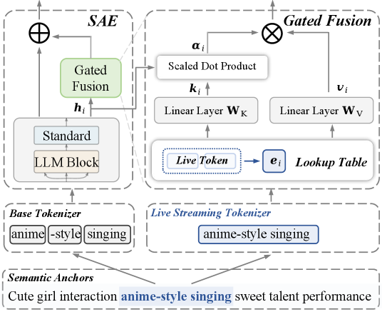
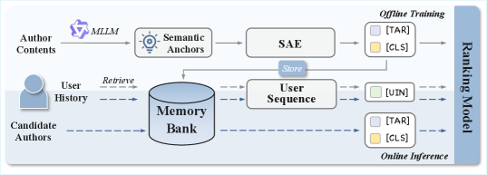
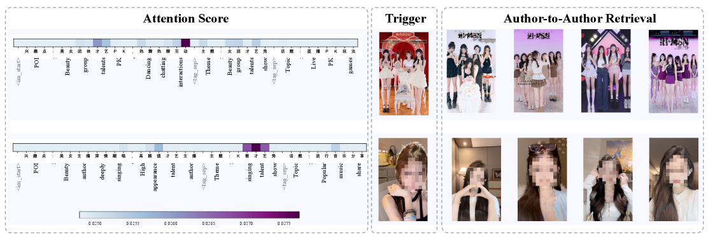

> 🌐 [Read in English](./sarm-llm-livestream-ranking.en.md)

论文精读笔记：[LLM-Augmented Semantic Anchor for End-to-End Live-Streaming Ranking](https://arxiv.org/abs/2602.09401)（Kuaishou Technology，2026）

## 核心思路

直播推荐中内容语义是非平稳的，现有方案要么用离散标签压缩语义（信息瓶颈），要么用稠密 Embedding 独立提取（和排序目标弱对齐）。SARM 把 LLM 生成的自然语言描述（语义锚点）直接嵌入排序优化，让语义理解和排序目标端到端联合训练，同时用轻量编码器和非对称部署控制延迟。

## 问题背景

直播场景有几个特殊挑战：

- **语义非平稳**：直播内容每分钟都在变，不像短视频可以提前分析好
- **实时性要求**：在线 serving 延迟极度敏感，大模型直接推理完全不可行
- **冷启动**：新主播没有历史行为，只能靠内容信号

现有两种方案的局限：

1. **离散语义抽象**（Tag / Semantic ID）：用聚类或 RQ-VAE 把多模态内容压成有限词表，可解释，但**离散瓶颈**不可避免，细粒度语义大量丢失
2. **稠密多模态 Embedding**：保留了高维语义，但和排序目标弱对齐，而且大模型在线推理根本跑不起来

两种方案的共同问题：**内容理解和排序优化之间有中间层，没法端到端**。

## 系统架构

SARM 由三个核心组件构成：**语义锚点（Semantic Anchor）**、**语义锚点编码器（SAE）**、**端到端排序模型**。

### 1. 语义锚点（Semantic Anchor）

**离线**用微调好的 MLLM（基于 Qwen-VL 系列）为每个主播生成结构化自然语言描述。输入三种模态：

- **视觉关键帧**：每场直播动态采样约 20 帧，优先面部特写和代表性场景
- **语音转写**：ASR 按时间窗口转录，和关键帧时间对齐
- **用户评论**：按互动价值过滤，保留 top 32 条有代表性的评论

生成的语义锚点覆盖六个维度：**POI、主题、话题、目标受众、形式、场景**。

形式上，主播 $\mathbf{s}$ 对应的语义锚点是 token 序列：

$$A_s = \{t_1, t_2, \ldots, t_n\}$$

关键设计：锚点 token 不是冻结的外部特征，而是**在排序 loss 中联合优化的可学习参数**，会随排序目标更新。这是和 SID / 稠密 Embedding 最根本的区别。

### 2. 语义锚点编码器（SAE）

直接用大 LLM 编码太慢，但小模型有个具体问题：直播领域的术语（比如"老铁"、"PUBG"）会被通用分词器切碎，小模型无法从碎片 token 恢复语义。

SAE 的解法是**双 Token 门控融合**：

#### 直播专用分词器

对历史直播语义锚点语料跑 BPE 合并，把高频共现术语合并为原子 token：

$$\text{PUBG} \rightarrow (t_1, t_2, t_3) = ({\rm P}, {\rm UB}, {\rm G}) \quad \xrightarrow{\text{BPE}} \quad \text{[PUBG]}$$

合并阈值 100k 次，持续按天增量更新。

#### 门控融合（Gated Fusion）

两路 token 序列并行处理：基础 LLM 编码原始序列得到隐状态 $h_i$，专用分词器编码增强序列得到 embedding $e_i$，然后用可学习门控融合：

$$\bm{k}_i = \mathbf{W}_K \bm{e}_i, \quad \bm{v}_i = \mathbf{W}_V \bm{e}_i$$

$$\alpha_i = \sigma\!\left(\frac{\text{RMSNorm}(\bm{h}_i)^\top \text{RMSNorm}(\bm{k}_i)}{\sqrt{d}}\right)$$

$$\bm{h}'_i = \bm{h}_i + \alpha_i \cdot \bm{v}_i$$

门控系数 $\alpha_i$ 是标量，决定每个位置注入多少领域语义。这样通用语言能力和领域知识可以**按需融合**，而不是硬替换。

#### 轻量 Backbone

SAE 用 4 层 BERT-style encoder + 单头注意力 + RoPE，取 `[CLS]` token 作为语义锚点的聚合表示 $h_\text{CLS}$。

为了同时捕捉内容语义和主播身份信号，引入显式主播 ID embedding，用 cross-attention 融合：

$$\bm{h}^\text{a}_\text{TAR} = \text{CrossAttention}(\bm{h}^\text{a}_{id}, \bm{h}, \bm{h})$$

### 3. 端到端排序模型

**作者侧**：$h^a_\text{CLS}$（语义）+ $h^a_\text{TAR}$（身份感知）

**用户侧**：从 Memory Bank 取历史观看作者的 embedding 序列，过 Transformer + MeanPooling 得到兴趣表示：

$$\bm{h}^u_\text{UIN} = \text{MeanPooling}\big(\text{Transformer}(\bm{h}^u)\big)$$

最终 concat 进现有多任务排序 backbone：

$$\hat{y} = \text{MultiTask}\bigl(\text{Concat}[h^a_\text{CLS},\, h^a_\text{TAR},\, h^u_\text{UIN},\, h_\text{rank}]\bigr)$$

## 训练目标

主任务：多目标 BCE，对 CTR / WTR / LVTR / GTR 等多个互动信号联合优化：

$$\mathcal{L}_\text{rec} = -\sum_{\text{xtr}}^{\text{Tasks}} \Bigl(y^\text{xtr} \log \hat{y}^\text{xtr} + (1 - y^\text{xtr}) \log(1 - \hat{y}^\text{xtr})\Bigr)$$

辅助任务：在作者侧表示上加一个轻量 CTR 预测头，单独监督语义表示：

$$\hat{y}_\text{aux} = \text{MLP}(\text{Concat}[h^a_\text{CLS}, h^a_\text{TAR}])$$

$$\mathcal{L}_\text{aux} = -y \log \hat{y}_\text{aux} - (1 - y) \log(1 - \hat{y}_\text{aux})$$

最终损失：

$$\mathcal{L} = \mathcal{L}_\text{rec} + \lambda \mathcal{L}_\text{aux}$$

辅助 loss 的作用是给语义表示直接施加排序信号，防止语义空间和排序空间的优化方向冲突导致不稳定。

## 实验结果

### 离线对比（快手直播数据集，4 亿用户 + 300 万主播）

| 模型 | CTR AUC | CTR GAUC | WTR AUC | WTR GAUC | LVTR AUC | LVTR GAUC | GTR AUC | GTR GAUC |
|---|---|---|---|---|---|---|---|---|
| Base | 0.8387 | 0.6453 | 0.9217 | 0.6500 | 0.8928 | 0.7542 | 0.9792 | 0.7319 |
| +Tags | 0.8390 | 0.6457 | 0.9220 | 0.6510 | 0.8932 | 0.7542 | 0.9794 | 0.7324 |
| +SIDs | 0.8389 | 0.6469 | 0.9221 | 0.6536 | 0.8936 | 0.7553 | 0.9799 | 0.7324 |
| +MLLM Emb | 0.8385 | 0.6451 | 0.9210 | 0.6475 | 0.8932 | 0.7551 | 0.9790 | 0.7320 |
| **SARM** | **0.8411** | **0.6485** | **0.9232** | **0.6522** | **0.8959** | **0.7580** | **0.9825** | **0.7369** |

几个值得注意的点：

- MLLM Embedding 在 CTR 和 WTR 上甚至不如 Base——印证了"密集嵌入跟排序目标脱节"的假设
- Semantic IDs 在 GAUC 上表现不错但 AUC 提升有限，说明离散化丢失了跨品类的细粒度区分
- SARM 在全部 8 个指标上领先，GTR GAUC 提升 +0.50%，在工业界非常显著

### Ablation 分析

| 替换组件 | CTR AUC Δ | CTR GAUC Δ | LVTR AUC Δ | LVTR GAUC Δ |
|---|---|---|---|---|
| 标准 Tokenizer 替换直播 Tokenizer | +0.07% | +0.10% | +0.08% | +0.11% |
| 去掉 Gated Fusion | +0.09% | +0.14% | +0.12% | +0.22% |
| 去掉 Cross Attention | +0.09% | +0.22% | +0.20% | +0.25% |
| 用 [CLS] 序列替代完整方案 | +0.18% | +0.30% | +0.27% | +0.33% |

去掉身份感知 Cross Attention 对 GAUC 影响最大（+0.22%/+0.25%），说明个体级表示对排序至关重要。

### 线上 A/B 测试

| 平台 | 曝光 | 观看数 | 观看时长 | 点击 | 打赏 | 有效观看 | 关注 |
|---|---|---|---|---|---|---|---|
| 快手 | +0.424% | +0.189% | +0.092% | +0.982% | +0.482% | +0.070% | +0.805% |
| 快手极速版 | +1.190% | +0.397% | +0.962% | +0.562% | +1.287% | +0.340% | +0.522% |

全量部署服务 **4 亿+日活用户**，极速版提升更大，可能是因为用户对推荐质量更敏感。

### 计算开销

| 指标 | Base | SARM |
|---|---|---|
| CPU 使用率 | 48.69% | 51.71% |
| GPU 使用率 | 77.54% | 80.29% |
| 训练时间 | 1.00x | 1.08x |
| QPS | 280.71 | 271.30 |
| 推理延迟 | 1.00x | 1.02x |

训练开销 +8%，推理延迟仅 +2%——非对称部署架构使得 author 侧重计算全部离线完成。

## 非对称部署

核心设计：Memory Bank 缓存每个主播的编码结果 $\mathcal{M}[a] = (h^a_\text{CLS}, h^a_\text{TAR})$。

- **离线**：定期跑 SAE 更新主播 embedding，写入 Memory Bank
- **在线**：直接查表，常数时间取到语义表示，SAE 不参与实时推理

这解决了"语义模型太重 / 在线 serving 太慢"的核心矛盾。

## 案例分析

对两个不同风格主播的语义锚点做注意力可视化：模型能精准定位到区分性词语（如游戏名称、受众定位），并基于锚点表示检索出语义相近的同类主播。说明锚点确实学到了有意义的内容语义，不是随机向量。

## 值得思考的点

1. **语义锚点 vs SID 的本质差异**：SID 用有限词表压缩语义（信息瓶颈不可避免），语义锚点直接用自然语言 token，理论上信息无损——但实际上轻量 SAE 能不能充分利用这些 token 还是个问题，4 层 transformer 够不够？

2. **MLLM 生成质量的天花板**：整个系统的上限取决于离线 MLLM 生成的语义锚点质量。论文提到了"domain-specific fine-tuning"，但对生成质量评估语焉不详。低质量的锚点会怎么影响排序？

3. **Memory Bank 的时效性**：主播的直播内容每天都在变（今天聊游戏，明天聊生活），但 Memory Bank 是异步更新的。这个滞后多大？对新主播或急剧转型的主播影响明显吗？

4. **专用分词器的可迁移性**：BPE 扩展分词器的思路在其他垂直领域（医疗、法律、金融）应该同样有效——这些领域也有大量通用模型无法正确分词的专有名词。

5. **冷启动真的解决了吗**？论文声称语义锚点有助于冷启动，但实验部分没看到专门的冷启动评测数据。一个没有任何历史行为的新主播，语义锚点真的够用吗？

## 参考

- [LLM-Augmented Semantic Anchor for End-to-End Live-Streaming Ranking](https://arxiv.org/abs/2602.09401)（arXiv 2602.09401）
